### Ejercicio 1: Suma de la diagonal principal y secundaria

Dada una matriz cuadrada `m` de números enteros de dimensión `d`, este algoritmo en Java calcula la suma de:

1. Los elementos de la **diagonal principal** (de la esquina superior izquierda a la esquina inferior derecha).
2. Los elementos de la **diagonal secundaria** (de la esquina superior derecha a la esquina inferior izquierda).

**Algoritmo**

Puedes ver el código completo del ejercicio en el archivo [`Ejercicio01.java`](./Ejercicio01.java).

**Resultado** 

A continuación se muestra una imagen con los resultados del Ejercicio 1:

  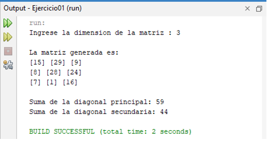

---

### Ejercicio 2: Rotación de una matriz 90°

Dada una matriz cuadrada `m` de dimensión `d`, escribe un algoritmo que permita rotar la matriz 90° en el sentido de las agujas del reloj. Por ejemplo:

  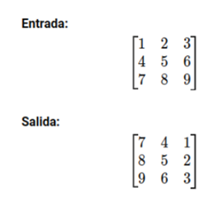

**Algoritmo**

Puedes ver el código completo del ejercicio en el archivo [`Ejercicio02.java`](./Ejercicio02.java).

**Resultado** 

A continuación se muestra una imagen con los resultados del Ejercicio 2:

  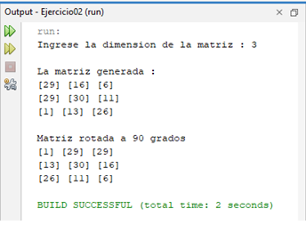

---

### Ejercicio 3: Perímetro de la matriz

Dada una matriz `m` de números enteros y dimensión `d`, escribe un algoritmo que calcule la suma de los elementos en el "perímetro" de la matriz (es decir, los elementos que están en los bordes). Por ejemplo:

  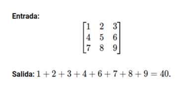

**Algoritmo**

Puedes ver el código completo del ejercicio en el archivo [`Ejercicio03.java`](./Ejercicio03.java).

**Resultado** 

A continuación se muestra una imagen con los resultados del Ejercicio 3:

  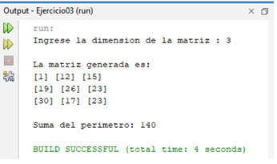

---

### Ejercicio 4: Transpuesta de una matriz

Dada una matriz `m` de `n×m`, escribe un algoritmo que genere la matriz transpuesta. Por ejemplo:

  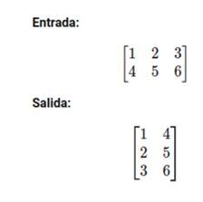

**Algoritmo**

Puedes ver el código completo del ejercicio en el archivo [`Ejercicio04.java`](./Ejercicio04.java).

**Resultado** 

A continuación se muestra una imagen con los resultados del Ejercicio 4:

  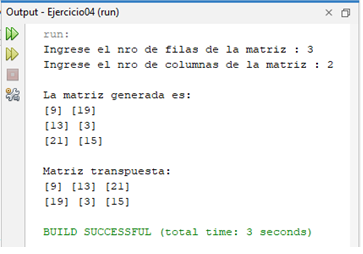

---

### Ejercicio 5: Verificar simetría de una matriz

Escribe un algoritmo que determine si una matriz cuadrada `m` es simétrica (es decir, si `m[i][j] = m[j][i]` para todos `i,j`).

  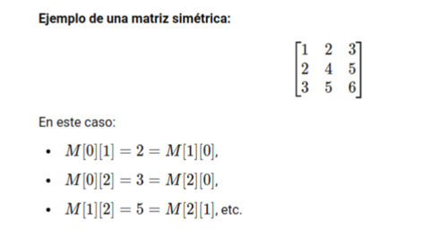

**Algoritmo**

Puedes ver el código completo del ejercicio en el archivo [`Ejercicio05.java`](./Ejercicio05.java).

**Resultado** 

A continuación se muestra una imagen con los resultados del Ejercicio 5:

  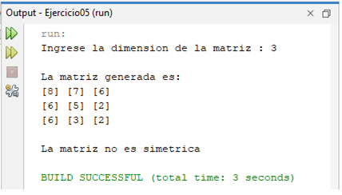

---

### Ejercicio 6: Recorrido en Espiral de una Matriz

Escribe un algoritmo que recorra una matriz cuadrada o rectangular `M` en forma de espiral, comenzando desde la esquina superior izquierda y moviéndose en sentido horario.

  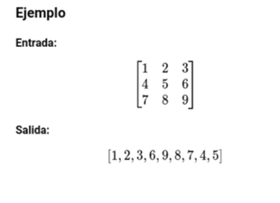

**Algoritmo**
Puedes ver el código completo del ejercicio en el archivo [`Ejercicio06.java`](./Ejercicio06.java).

**Resultado** 

A continuación se muestra una imagen con los resultados del Ejercicio 6:

  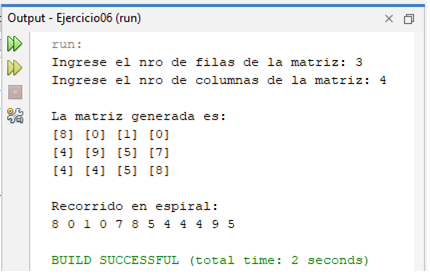

---

### Ejercicio 7: Suma de Anillos en una Matriz Cuadrada

Escribir un algoritmo que, dada una matriz cuadrada `m` de números enteros y dimensión `d`, permita sumar los elementos de un 'anillo' cualquiera `k`. En el ejemplo, aparece una matriz de dimensión 6 con sus tres anillos (numerados como se indica en la figura, de fuera hacia dentro).

  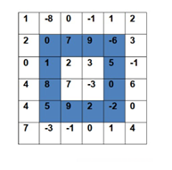

**Algoritmo**

Puedes ver el código completo del ejercicio en el archivo [`Ejercicio07.java`](./Ejercicio07.java).

**Resultado** 

A continuación se muestra una imagen con los resultados del Ejercicio 7:

  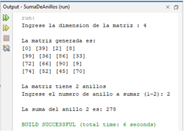

